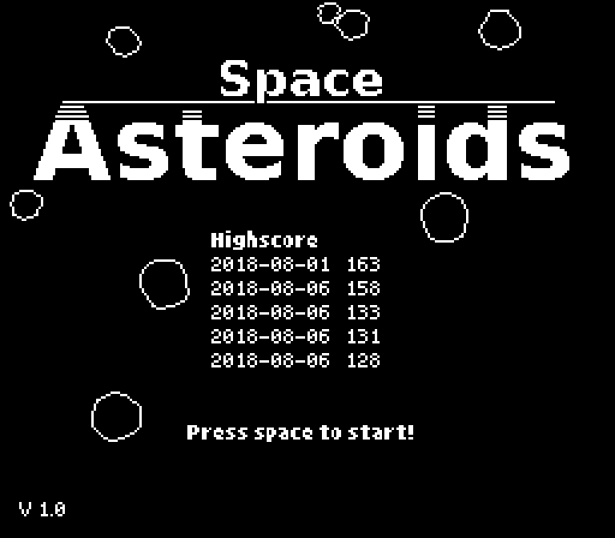
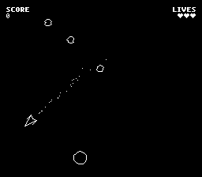
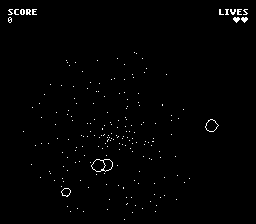

# Space Asteroids

A Draw16 and rawbeep.js tech-demo. See also:

| Project                                                     | Description                                                  |
| ----------------------------------------------------------- | ------------------------------------------------------------ |
| [draw16](https://github.com/philipp-schwarz/draw16)         | A fast JavaScript graphic engine for retro games with low screen resolution |
| [rawbeep.js](https://github.com/philipp-schwarz/rawbeep.js) | BEEP and SOUND statement for JavaScript                      |

## Play online

This is not a big game, just a small demo. Enjoy :-)

[PLAY ONLINE](https://philipp-schwarz.github.io/dist/asteroids/)

## Screenshots




 


## Getting started

If you want to edit the code, you need a webserver running at localhost. Any server will do.

Install (may require root)

```bash
npm install -g node-static
```

Run

```bash
cd src
static -p 8000
```

Open

http://localhost:8000/

You need to refresh the page every time you made changes to the code.

## Build

When you are done coding, you can "build" the app to a single HTML-File:

```
./build/build.sh
```

This will generate a "start.html" file that embeds all PNG and JS files. Your game is now portable, standalone and works without a webserver.

How does it work?

The index.html file is scanned for every Path in (") or (') that ends with ".js" or ".png". These files will be converted to base64 inline URLs. The filesize of your HTML-file will incerase, but it contains everything you need now. 